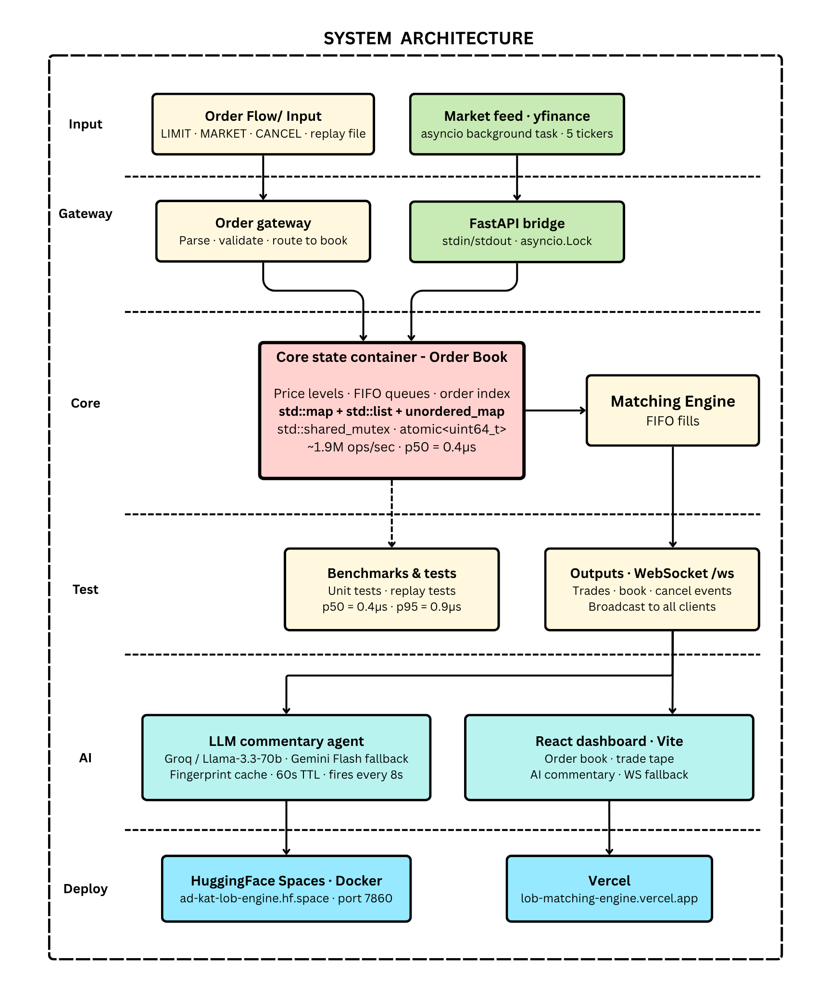

# Limit Order Book & Matching Engine

A price-time priority matching engine written in C++20, capable of ~1.9M operations/sec with sub-microsecond median latency. The C++ engine is the actual project — FastAPI, React dashboard, LLM commentary agent, and market data feed are all demo infrastructure built on top.

**Live demo:** [lob-matching-engine.vercel.app](https://lob-matching-engine.vercel.app) · **API:** [ad-kat-lob-engine.hf.space](https://ad-kat-lob-engine.hf.space)

---

## How it works

```
Real NASDAQ tick data (yfinance)
        ↓
asyncio background task (market feed)
        ↓
  POST /orders/limit  /orders/market
        ↓
FastAPI + async subprocess bridge (asyncio.Lock)
        ↓
C++ LOB binary — matching engine core
        ↓
WebSocket /ws → React dashboard + LLM commentary agent
                                        ↓
                          Groq/Llama-3.3-70b narrates
                          market microstructure in real time
                          (Gemini Flash fallback, 60s cache)
```

The Python server spawns the C++ binary in interactive mode and pipes commands over stdin/stdout. An `asyncio.Lock` serialises concurrent HTTP requests so nothing interleaves. Every trade and book update is broadcast to connected WebSocket clients immediately. An LLM commentary agent fires every 8 seconds, narrating order flow — "AAPL sees steady buy pressure, lifting the tape." — with a fingerprint-based cache to avoid burning API quota on similar market states.

---

## System Architecture



## Why these data structures

The cancel path is where most LOB implementations get it wrong. A naïve approach scans the price level queue linearly — O(n) per cancel, which falls apart under real order churn.

Here, each resting order is indexed by `unordered_map<OrderId, list::iterator>`. Cancellation is O(1): look up the iterator, call `list::erase()`, done. `std::list` is the right structure because erase-by-iterator is O(1) and doesn't invalidate other iterators — something `std::deque` can't offer.

Price levels live in `std::map<int64_t, Level>` (bids with `std::greater<>` for descending order), which keeps the best bid/ask at `begin()` without manual sorting.

**Benchmarks** (70% limit adds, 20% cancels, 10% market orders):
```
~1.9M ops/sec   p50 = 0.4µs   p95 = 0.9µs
```

```bash
./build/lob --bench 1000000
```

---

## LLM commentary agent

Every 8 seconds, a snapshot of the current book state (best bid, best ask, spread, recent trades) is sent to Groq/Llama-3.3-70b, which returns a one-sentence narration of what is happening in the market. The commentary is broadcast as a `commentary` WebSocket event and displayed in the dashboard with a purple AI badge.

**Caching:** Responses are keyed by a fingerprint of `symbol + price_bucket ($0.50) + spread_bucket ($0.10) + last_event + trade_bucket`. If the market state is similar enough to a recent snapshot, the cached string is reused — no API call. TTL is 60 seconds.

**Fallback chain:** Gemini Flash → Groq/Llama-3.3-70b → static fallback string. After 3 consecutive Gemini failures, Gemini is skipped for 2 minutes to avoid hammering a rate-limited key.

Sample commentary seen in production:
```
AAPL sees steady buy pressure, lifting the tape.
AAPL selling pressure evident with lone ask at $293.68.
MSFT bid side thinning — spread widening into close.
```

---

## Deployment — what failed, what worked

Getting a free, always-on deployment for a multi-stage Docker build (C++ compile + Python runtime) turned out to be harder than the engine itself.

**Railway** — tried first. Build worked, C++ compiled fine. Killed after a few days when the free $5 credit ran out. No free tier for persistent services anymore.

**Fly.io** — tried next. Free tier looks generous on paper but requires a credit card to deploy anything beyond the most basic app. Card requirement disqualified it.

**Render** — free tier spins down after 15 minutes of inactivity. The C++ binary takes ~30 seconds to recompile on cold start, making the spin-up delay unacceptable for a live demo.

**Hugging Face Spaces** — works. Free forever, no card required, Docker support, persistent. The catch: port must be `7860` (HF default), not `8000`. Multi-stage Dockerfile compiles C++ in Ubuntu, copies the binary into `python:3.12-slim`, runs uvicorn on port `7860`. Environment secrets (API keys) are set via the HF Spaces UI, not `.env` files — the container doesn't read `.env` at runtime.

**Vercel** — React dashboard deployed here, pointed at the HF Spaces API via `VITE_API_URL` environment variable. Free, instant deploys on every GitHub push.

**Node/WSL conflict** — `npm install` kept failing with UNC path errors because WSL was picking up the Windows Node installation. Fix: `export PATH=/usr/bin:$PATH` before any npm command. Made permanent via `~/.bashrc`.

---

## Running the full stack locally

Three terminals. Run them in order.

### Terminal 1 — C++ engine + API

```bash
# First time only
python3 -m venv lobenv
pip install -r requirements.txt

source lobenv/bin/activate
cmake -B build -DCMAKE_BUILD_TYPE=Release
cmake --build build --target lob -j$(nproc)

LOB_BINARY=./build/lob uvicorn api.main:app --reload --port 8000
```

> cmake warnings about `DOWNLOAD_EXTRACT_TIMESTAMP` and clock skew are harmless.

Swagger UI: **http://localhost:8000/docs**

### Terminal 2 — Market data feed (local only)

The market feed runs automatically as an asyncio background task when deployed. Locally, if you want to run it standalone:

```bash
source lobenv/bin/activate
python3 market_feed.py --ticker AAPL --speed 0.2
```

| Flag | Default | What it does |
|------|---------|-------------|
| `--ticker` | `AAPL` | Any Yahoo Finance ticker — `TSLA`, `SPY`, `NVDA`, `MSFT` |
| `--interval` | `1m` | Bar size: `1m`, `2m`, `5m` |
| `--period` | `1d` | `1d` for today, `5d` for a week |
| `--speed` | `0.2` | Seconds per bar — `0.1` fast, `1.0` real-time |

Data is in-memory only — restarting the API resets engine state.

### Terminal 3 — React dashboard

```bash
cd lob-dashboard

# WSL users only — fixes Windows Node conflict
export PATH=/usr/bin:$PATH

# First time only
npm install

npm run dev
# → http://localhost:5173
```

The dashboard connects to `ws://localhost:8000/ws` automatically and falls back to mock data if the API isn't running.

### Environment variables

Create a `.env` in the project root (gitignored):

```
GROQ_API_KEY=your_groq_key_here
GEMINI_API_KEY=your_gemini_key_here   # optional, Groq is the primary
```

Get a free Groq key (no card): [console.groq.com](https://console.groq.com)

---

## REST API

| Method | Endpoint | Description |
|--------|----------|-------------|
| `GET` | `/health` | Engine status |
| `GET` | `/book` | Best bid / best ask / spread |
| `POST` | `/orders/limit` | Place a limit order |
| `POST` | `/orders/market` | Place a market order |
| `DELETE` | `/orders/{id}` | Cancel a resting order |

Place a sell, then cross the spread:
```bash
curl -X POST http://localhost:8000/orders/limit \
  -H "Content-Type: application/json" \
  -d '{"order_id": 1, "side": "SELL", "price": 101, "qty": 10}'

curl -X POST http://localhost:8000/orders/limit \
  -H "Content-Type: application/json" \
  -d '{"order_id": 2, "side": "BUY", "price": 103, "qty": 5}'
# → "trades": [{"price": 101, "qty": 5, "buy_id": 2, "sell_id": 1}]
```

Watch live via WebSocket:
```bash
npm install -g wscat
wscat -c ws://localhost:8000/ws
```

WebSocket events:

| Event | Payload |
|-------|---------|
| `trade` | `{price, qty, buy_id, sell_id}` |
| `book` | `{best_bid, best_ask, spread}` |
| `cancel` | `{order_id, book}` |
| `commentary` | `{symbol, text, event}` |

---

## Tests

```bash
cmake --build build --target lob_tests
ctest --test-dir build --output-on-failure
```

Covers basic matching, FIFO same-price priority, market orders, multi-level fills, cancel, and cancel of already-filled orders.

---

## Docker

```bash
docker compose up --build
```

Multi-stage: Stage 1 compiles on Ubuntu 24.04, Stage 2 copies the binary into `python:3.12-slim`. For HuggingFace Spaces deployment, port is `7860`.

---

## Project structure

```
.
├── src/
│   ├── main.cpp            # File replay / interactive / benchmark modes
│   └── order_book.cpp      # Matching engine
├── include/
│   └── order_book.hpp      # OrderBook, Order, Trade, Side
├── api/                    # Demo layer
│   ├── main.py             # FastAPI app + market feed background task
│   ├── engine.py           # Async subprocess bridge
│   ├── models.py           # Pydantic models
│   ├── ws_manager.py       # WebSocket broadcast
│   └── commentary.py       # LLM commentary agent (Groq + Gemini, cached)
├── lob-dashboard/          # React + Vite dashboard
│   └── src/
│       ├── App.jsx
│       ├── hooks/useLOB.js
│       └── components/
│           ├── OrderBook.jsx
│           ├── TradeTape.jsx
│           ├── StatsBar.jsx
│           └── Commentary.jsx
├── tests/                  # GoogleTest suite
├── data/sample.txt         # Hand-written order feed
├── market_feed.py          # Standalone market data script (local use)
├── Dockerfile              # Multi-stage: Ubuntu (C++) → python:3.12-slim
├── docker-compose.yml
└── requirements.txt
```

---

## Roadmap

- [x] C++ matching engine — price-time priority FIFO, ~1.9M ops/sec, sub-μs latency
- [x] O(1) cancel — `unordered_map<OrderId, list::iterator>` index
- [x] Thread-safe LOB — `std::shared_mutex` for concurrent access
- [x] Lock-free order ID generator — `std::atomic<uint64_t>`
- [x] Benchmark harness — mixed workload, p50/p95 latency reporting
- [x] GoogleTest suite — matching, FIFO priority, market orders, multi-level fills, cancel
- [x] FastAPI layer — REST + WebSocket, async subprocess bridge
- [x] Real market data ingestion — Yahoo Finance OHLCV → LOB order flow (asyncio background task)
- [x] Docker — multi-stage build, HuggingFace Spaces compatible
- [x] React dashboard — pastel purple, live order book depth + trade tape, mock fallback
- [x] LLM commentary agent — Groq/Llama-3.3-70b + Gemini Flash fallback, fingerprint cache
- [x] Deploy — HuggingFace Spaces (API) + Vercel (dashboard), public URLs
- [ ] SQLite trade log — persist sessions across restarts
- [ ] FIX 4.2 parser — industry-standard order ingestion
- [ ] ML anomaly detection — spoofing and wash trading flags

---

**Adri Katyayan** — [LinkedIn](https://www.linkedin.com/in/adri-katyayan-21a0b2222/) · [GitHub](https://github.com/ad-kat)  
MS Computer Science, Stony Brook University